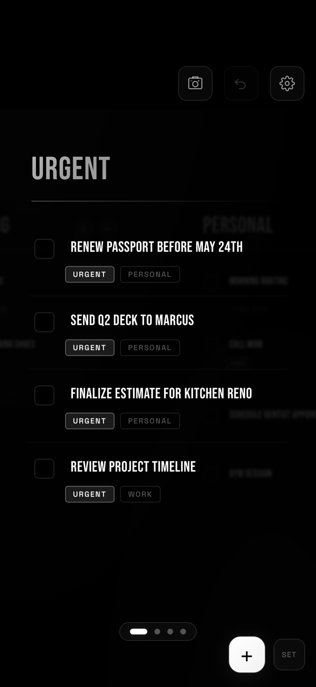
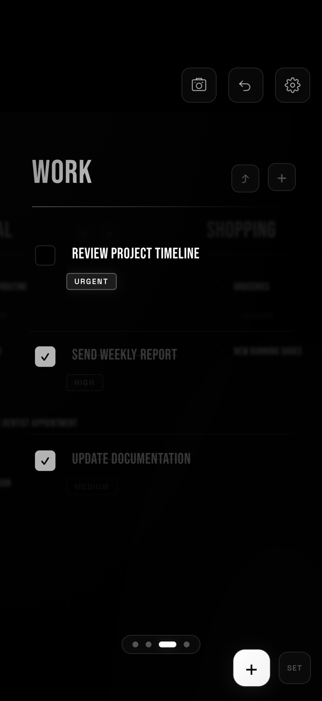
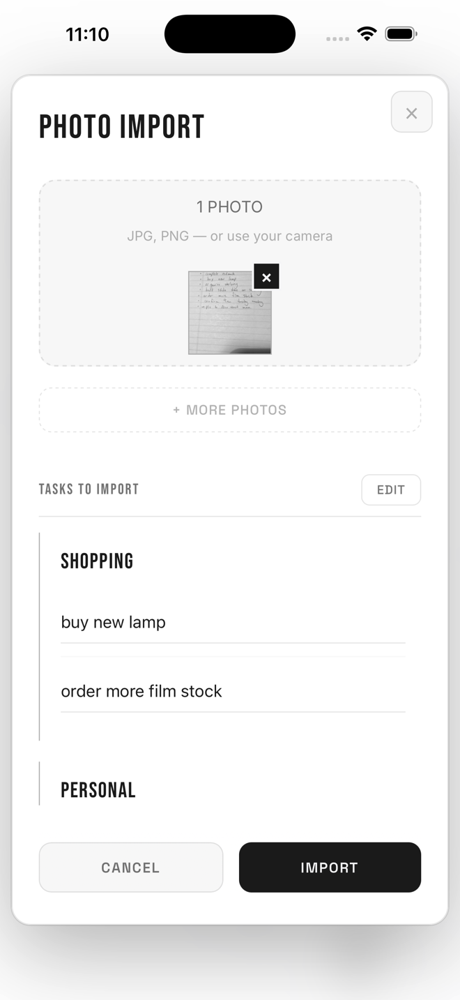
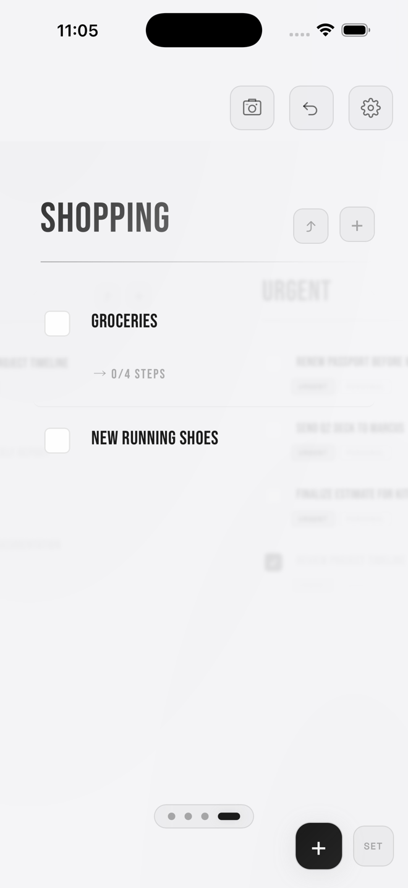
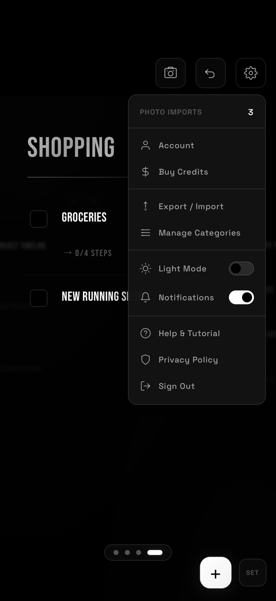

# MYLIST

```
╔╦╗╦ ╦╦  ╦╔═╗╔╦╗
║║║╚╦╝║  ║╚═╗ ║ 
╩ ╩ ╩ ╩═╝╩╚═╝ ╩ 
```

**A brutally simple, obsessively minimal task manager.**  
*Peaceful. Focused. Yours.*

[](.)
[](.)

<br>

### → [**DOWNLOAD ON THE APP STORE**](https://apps.apple.com/ca/app/mylist-task-list/id6765983895) ←

### → [**OPEN THE WEB APP**](https://piotrtomanek.github.io/MyList/app.html) ←

*Native on iOS, or runs in your browser. Nothing to install.*

---

## SCREENSHOTS

| Urgent view | Your worlds | Handwriting → tasks | Light mode | One menu |
|:---:|:---:|:---:|:---:|:---:|
|  |  |  |  |  |

---

## WHAT IS THIS

MyList is a single-file HTML task manager built for calm, focused productivity.

It looks like a poster. It works like a machine. Core task management is free, works offline, and requires no account. The **Photo Import** feature — which reads your handwritten notes and turns them into organised tasks — uses AI credits.

---

## FEATURES

```
✦  Carousel categories     — swipe between your worlds
✦  Swipe-to-delete         — satisfying, fast, clean
✦  Priority system         — URGENT / HIGH / MEDIUM / none
✦  Steps / subtasks        — break things down without drowning
✦  Photo import via AI     — snap a handwritten list, watch it digitize
✦  Export to JSON / TXT    — your data stays yours
✦  Calendar export         — .ics for Apple & Google Calendar
✦  Works offline           — always (except photo import)
```

---

## QUICK START

```bash
# Option A — just open it
open mylist.html

# Option B — serve it locally
npx serve .
# → http://localhost:3000/mylist.html

# Option C — host it anywhere
# Drop the file on Netlify, GitHub Pages, Vercel. Done.
```

No `npm install`. No `package.json`. No build step.

---

## THE PHOTO IMPORT THING

This is the party trick.

Take a photo of any handwritten list — grocery list on a napkin, whiteboard notes, sticky notes on your monitor — and MyList reads it and imports everything automatically, organised into categories.

**How it works:**
1. Tap **SCAN** in the top right
2. Sign in or create a free account *(you get 3 free imports to start)*
3. Upload a photo or multiple photos
4. Watch it parse your chaos into organised tasks
5. Edit anything before importing
6. Confirm — tasks land exactly where they belong

> Photo processing uses Anthropic's Claude AI. Each import uses 1 credit.  
> New accounts start with **3 free credits**.  
> Top up with **50 imports for $2.99** via in-app purchase.

---

## HOW TO USE IT

### Navigation
| Action | How |
|--------|-----|
| Switch categories | Swipe left/right **or** arrow keys |
| Add a task | Tap **+** (bottom right) |
| Check off a task | Tap the checkbox |
| Delete a task | Swipe left on it |
| Edit task text | Tap it and type |
| Rename a category | Tap the big title and type |

### Categories
The **URGENT** category is special — it automatically pulls in every task across all your lists that's marked urgent. Think of it as your daily hit list.

Everything else is yours to name. Work. Home. Side project. Whatever you need.

### Priority System
```
URGENT   →  Shows up in the URGENT view. Fix this today.
HIGH     →  Important. Don't forget it.
MEDIUM   →  Noted. Eventually.
(none)   →  It's on the list, relax.
```

### Steps / Subtasks
Tap `+ STEPS` on any task to break it into numbered steps. Great for multi-part tasks you always forget half of.

---

## DATA & STORAGE

Your tasks live in `localStorage` — your browser's built-in storage.

**Task data never leaves your device** unless you explicitly export it.

Account data (email, credit balance) is stored securely via Supabase.

```
Export options:
  → JSON    (full backup, re-importable)
  → TXT     (human-readable)
  → .ICS    (calendar, works with Apple/Google)
  → Copy    (paste anywhere)

Import options:
  → From file      (.json backups)
  → Paste JSON     (from clipboard)
  → Photo scan     (AI-powered, uses 1 credit per import)
```

---

## TECH STACK

```
HTML        ████████████████  100%
CSS         ████████████████  100%
JavaScript  ████████████████  100%
Frameworks  ░░░░░░░░░░░░░░░░    0%
```

Fonts: **Bebas Neue** + **Inter** via Google Fonts  
AI: Anthropic's Claude API *(photo import only)*  
Auth & credits: Supabase *(account required for photo import)*

---

## FILE STRUCTURE

```
mylist.html        ← the entire app
README.md          ← you are here
```

---

## ROADMAP

```diff
+ Supabase auth & credit system
+ Photo import paywall (3 free, $2.99 / 50)
- Drag to reorder tasks
- Long-press context menu (change priority, move category)
- Undo delete (brief toast)
? Apple Sign In
? PWA / installable app
? Recurring tasks
```

---

## CONTRIBUTING

1. Fork it
2. Break it
3. Fix it better
4. Open a PR with a clear description of what changed and why

The aesthetic is intentional. Black. Minimal. Bebas Neue. If you're adding UI, make it match.

---

## PHILOSOPHY

Most task apps try to be platforms. They want your email, your subscription, your attention, your data.

MyList wants almost nothing. The core is still just a file. Your tasks stay on your device. The only thing that touches a server is photo import — and only when you choose to use it.

**Get the thing done. Close the tab. Live your life.**

---

*Built with obsessive attention to simplicity.*

**[⬇ Open the App](./app.html)** · **[🐛 Issues](../../issues)** · **[⭐ Star if you use it](../../stargazers)**
